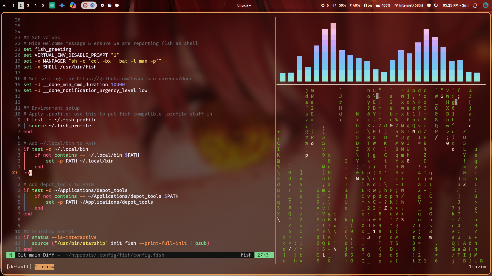
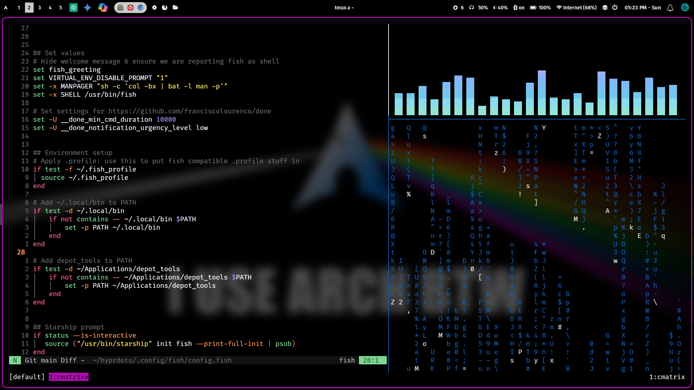
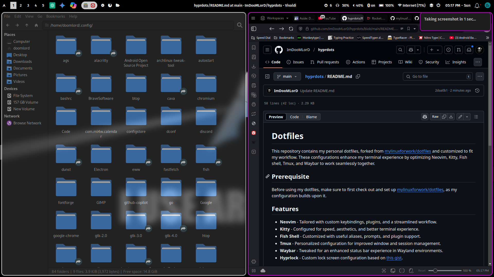
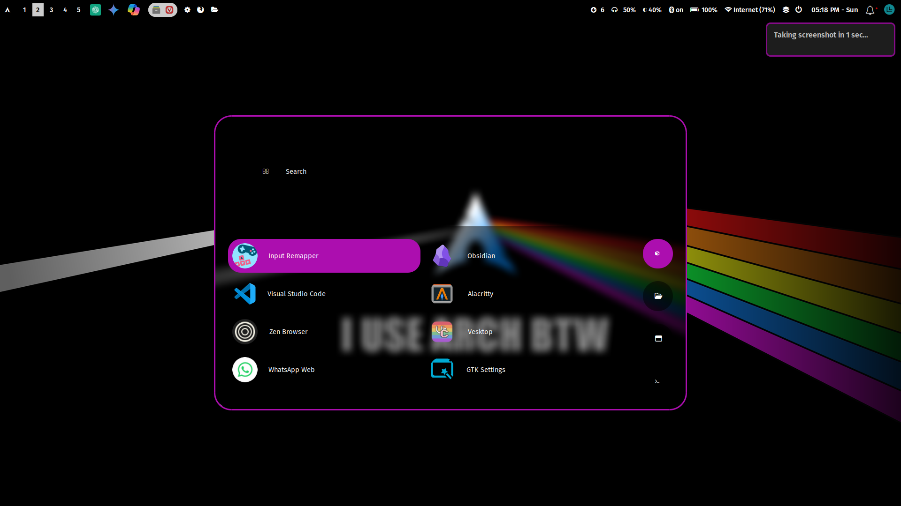

# Dotfiles

This repository contains my personal dotfiles, forked from [mylinuxforwork/dotfiles](https://github.com/mylinuxforwork/dotfiles) and customized to fit my workflow. These configurations enhance my terminal experience by optimizing Neovim, Kitty, Fish shell, Tmux, and Waybar to work seamlessly together.

## Prerequisite

Before using my dotfiles, make sure to first check out and set up [mylinuxforwork/dotfiles](https://github.com/mylinuxforwork/dotfiles), as my configuration builds upon it.

<!-- ## Screenshots










 -->
## Screenshots Gallery 📸

<table>
  <tr>
    <td></td>
    <td></td>
    <td></td>
  </tr>
  <tr>
    <td></td>
    <td></td>
    <td></td>
  </tr>
  <tr>
    <td></td>
    <td></td>
    <td></td>
  </tr>
</table>


## Features

- **Neovim** - Tailored with custom keybindings, plugins, and a streamlined workflow.
- **Kitty** - Configured for speed, aesthetics, and better terminal experience.
- **Fish Shell** - Customized with useful aliases, prompts, and plugin support.
- **Tmux** - Personalized configuration for improved window and session management.
- **Waybar** - Tweaked for an enhanced status bar experience in Wayland environments.
- **Hyprlock** - Custom lock screen configuration based on [this gist](https://gist.github.com/ashish-kus/dd562b0bf5e8488a09e0b9c289f4574c).

## Installation

1. First, clone the original dotfiles repository:
   ```sh
   git clone https://github.com/mylinuxforwork/dotfiles ~/.ml4w-dotfiles
   ```
2. Then, clone this repository:
   ```sh
   git clone https://github.com/ImDooMLorD/hyprdots.git ~/.dotfiles
   ```
3. Change to the dotfiles directory:
   ```sh
   cd ~/.dotfiles
   ```
4. Manually symlink configurations:
   ```sh
   ln -s ~/.dotfiles/nvim ~/.config/nvim
   ln -s ~/.dotfiles/kitty ~/.config/kitty
   ln -s ~/.dotfiles/fish ~/.config/fish
   ln -s ~/.dotfiles/tmux ~/.tmux.conf
   ln -s ~/.dotfiles/waybar ~/.config/waybar
   ln -s ~/.dotfiles/hyprlock ~/.config/hypr/hyprlock.conf
   ```

## Customization

Feel free to explore the configuration files and tweak them according to your needs. Each configuration is well-structured to make modifications easy.

## Credits

- Original repository: [mylinuxforwork/dotfiles](https://github.com/mylinuxforwork/dotfiles)
- Hyprlock configuration based on [this gist](https://gist.github.com/ashish-kus/dd562b0bf5e8488a09e0b9c289f4574c)

---

If you have any suggestions or improvements, feel free to open an issue or submit a pull request!

